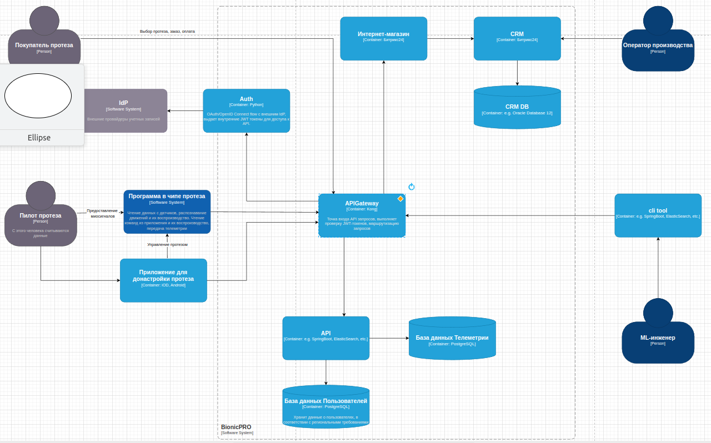
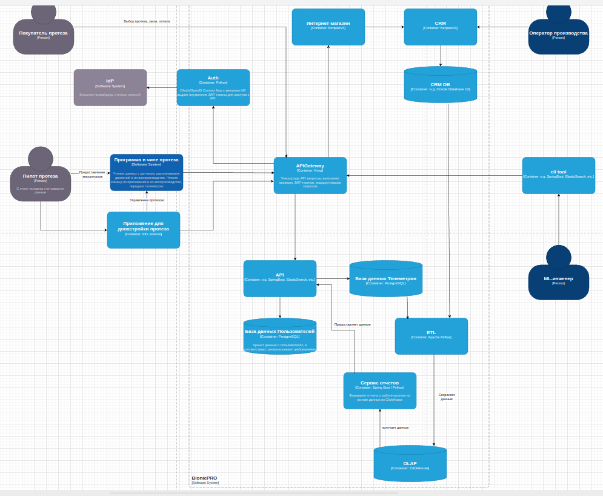

# architecture-bionicpro

## Задание 1

### Измененная диаграмма



## Задание 2

### Измененная диаграмма



## Запуск проекта

```bash
docker-compose up -d --build
```

Ручной запуск DAG с определённой датой выполнения

```bash
docker-compose exec -it airflow-scheduler bash
airflow dags trigger -e 2025-10-18 reports_etl
airflow dags trigger -e 2025-10-19 reports_etl
airflow dags trigger -e 2025-10-20 reports_etl
airflow dags trigger -e 2025-10-21 reports_etl
airflow dags trigger -e 2025-10-22 reports_etl
```
