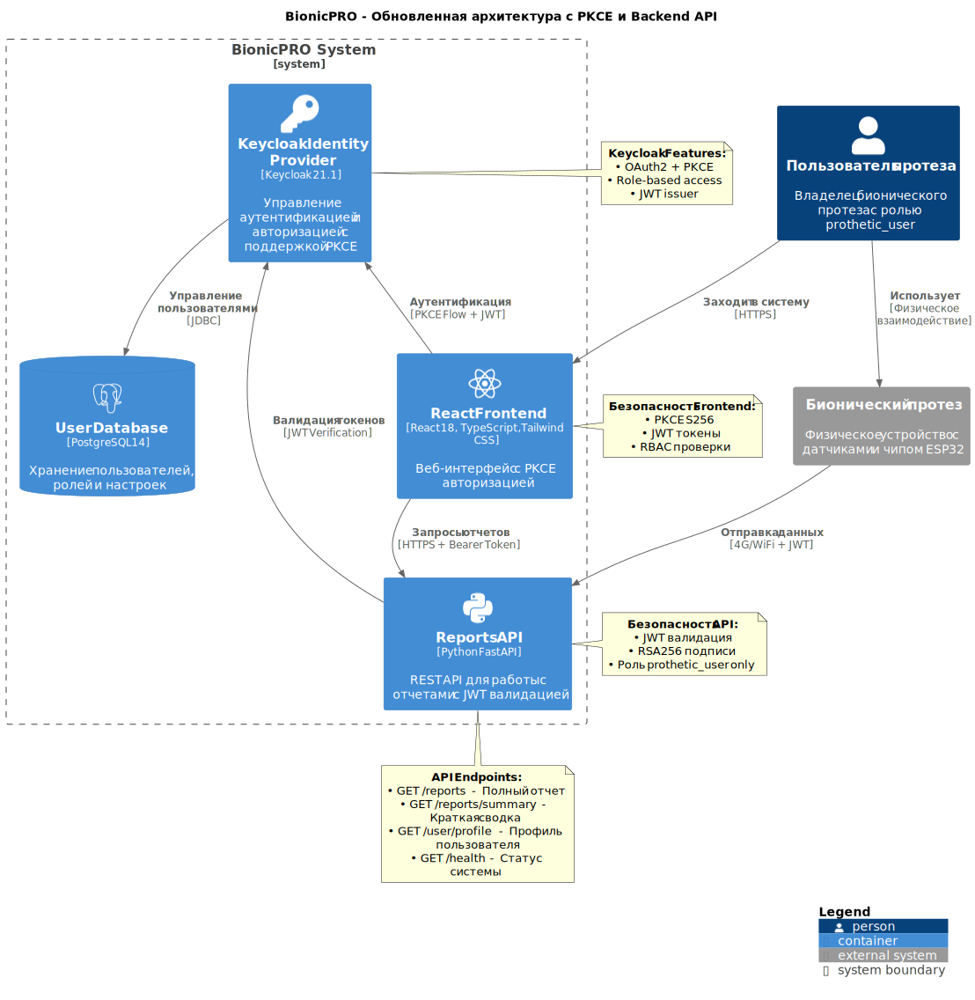

# BionicPRO - Система управления отчетами по бионическим протезам

> **Учебный проект 8-го спринта курса ["Архитектор программного обеспечения"](https://practicum.yandex.ru/software-architect/) Яндекс Практикума**

## Описание проекта

BionicPRO - это система для управления отчетами об использовании бионических протезов, построенная с использованием современных принципов безопасности и микросервисной архитектуры.

## Архитектура системы



### Компоненты системы:

1. **React Frontend** (`:3000`) - Веб-интерфейс с поддержкой PKCE
2. **Keycloak** (`:8080`) - Identity Provider для аутентификации и авторизации
3. **FastAPI Backend** (`:8000`) - REST API для работы с отчетами
4. **PostgreSQL** (`:5433`) - База данных пользователей и настроек

## Особенности безопасности

### PKCE (Proof Key for Code Exchange)
- Реализован PKCE S256 для защиты от перехвата authorization code
- Настроен в Keycloak и React frontend
- Повышенная безопасность для публичных клиентов

### JWT Validation
- Валидация JWT токенов с RSA256 подписями
- Проверка audience и issuer
- Автоматическое получение публичных ключей от Keycloak

### Role-Based Access Control (RBAC)
- Доступ к отчетам только для роли `prothetic_user`
- Гранулярный контроль доступа к API эндпоинтам
- Проверка ролей на уровне API и UI

## API Эндпоинты

| Метод | Путь | Описание | Требуемая роль |
|-------|------|----------|----------------|
| `GET` | `/` | Информация о сервисе | - |
| `GET` | `/health` | Проверка состояния | - |
| `GET` | `/user/profile` | Профиль пользователя | Любая |
| `GET` | `/reports` | Полный отчет об использовании | `prothetic_user` |
| `GET` | `/reports/summary` | Краткая сводка отчета | `prothetic_user` |

## Тестовые пользователи

### С доступом к отчетам (роль: `prothetic_user`)
- `prothetic1` / `prothetic123`
- `prothetic2` / `prothetic123`  
- `prothetic3` / `prothetic123`

### Без доступа к отчетам
- `user1` / `password123` (роль: `user`)
- `user2` / `password123` (роль: `user`)
- `admin1` / `admin123` (роль: `administrator`)

## Установка и запуск

### Предварительные требования
- Docker и Docker Compose
- Свободные порты: 3000, 8000, 8080, 5433

### Запуск проекта
```bash
# Клонирование репозитория
git clone <repository-url>
cd architecture-bionicpro

# Запуск всех сервисов
docker compose up -d --build

# Проверка статуса
docker compose ps
```

### Доступ к сервисам
- **Frontend:** http://localhost:3000
- **Keycloak Admin:** http://localhost:8080/admin (admin/admin)
- **API Documentation:** http://localhost:8000/docs
- **API Health Check:** http://localhost:8000/health

## Структура отчета

Пример JSON отчета, который генерирует API:

```json
{
  "user_id": "uuid",
  "username": "prothetic1",
  "report_period": "2024-01-01 to 2024-01-31",
  "generated_at": "2024-01-31T12:00:00",
  "prosthetic_id": "BIONIC-PROTHETIC1-1234",
  "total_usage_hours": 285.6,
  "daily_usage": [...],
  "battery_stats": {...},
  "movement_patterns": {...},
  "calibration_history": [...]
}
```

## Тестирование

### Тестирование PKCE
1. Откройте браузер в режиме разработчика
2. Перейдите на http://localhost:3000
3. В Network tab проверьте запросы к Keycloak - должны содержать `code_challenge` и `code_challenge_method=S256`

### Тестирование RBAC
1. Войдите как `user1` - доступ к отчетам должен быть запрещен
2. Войдите как `prothetic1` - доступ к отчетам разрешен

### Тестирование API
```bash
# Health check
curl http://localhost:8000/health

# Попытка доступа без авторизации (должна вернуть 401)
curl http://localhost:8000/reports
```

## Конфигурация

### Переменные окружения

#### API Service
- `KEYCLOAK_URL`: URL Keycloak сервера (по умолчанию: http://keycloak:8080)
- `KEYCLOAK_REALM`: Имя realm (по умолчанию: reports-realm)
- `ENVIRONMENT`: Окружение (development/production)

#### Frontend
- `REACT_APP_API_URL`: URL API сервера
- `REACT_APP_KEYCLOAK_URL`: URL Keycloak для браузера
- `REACT_APP_KEYCLOAK_REALM`: Имя realm
- `REACT_APP_KEYCLOAK_CLIENT_ID`: ID клиента