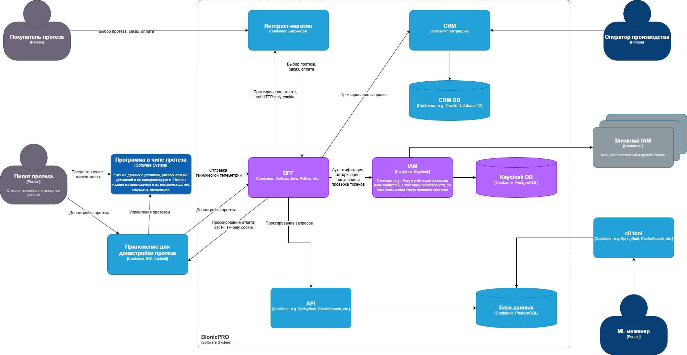

## Задание 1. Повышение безопасности системы

### Архитектурное решение для управления учётными данными пользователя

Внутри системы BionicPRO добавляем IdP Keycloak. Данный сервис будет служить как SSO для всех приложений системы (CRM, интернет-магазин, API). Реализуем Federated Identity, который позволяет настроить доступы для сотрудников из разных стран (одно из требований бизнеса). Keycloak поддерживает федерализацию.

Для исключения передачи access и refresh токенов на фронтенд (одно из требований бизнеса) предлагается воспользоваться паттерном BFF (Backend For Frontend). Токены будут храниться на "промежуточном" бэкенде, который будет осуществлять все взаимодействие с Keycloak. На фронтенд будет приходить только сессионная Http-Only cookie, которую BFF будет разменивать на access_token. BFF будет обновлять access_token по refresh_token, который также будет храниться на сервере. Время жизни access_token - 5 минут.

Для мобильного приложения будет использоваться PKCE (Proof Key for Code Exchange), то есть дополнительно будет запрашиваться code_verifier.

Также рекомендуется настроить RBAC (Role-Based Access Control) для разделения доступов к данным на основе ролей.

