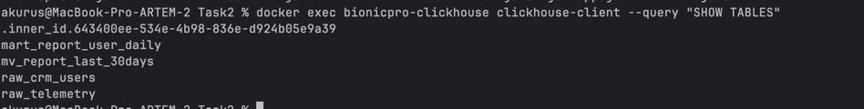
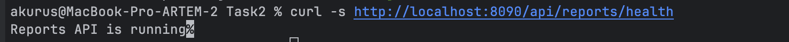
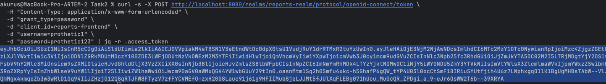
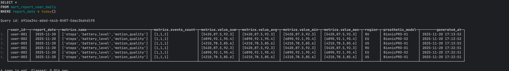

## BionicPRO Reports Service — Java ETL & Analytics

## Задание 1 Диаграмма архитектуры системы 

[Диаграмма архитектуры](./arch/bionicpro_reports_c4_container.puml)

### Таблицы clickhouse

### health

### Получение токена

### Отчет в таблице

### Получение отчета: curl -s -H "Authorization: Bearer $TOKEN"   "http://localhost:8090/api/reports?userId=user-001&dateFrom=2025-11-19&dateTo=2025-11-20" | jq

### DAGs http://localhost:8091/home
