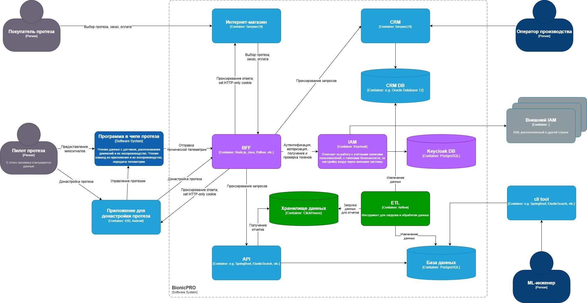

## Задание 2. Разработка сервиса отчётов

### Архитектурное решение для подготовки и получения отчётов

С помощью Apache Airflow в OLAP БД ClickHouse объединяются данные из CRM и данные с датчиков.

### Разработать Airflow DAG и настроить его на запуск по расписанию

Был реализован DAG в Airflow, который запускается по расписанию - раз в 5 минут.

Данные из двух БД - БД CRM (PostgreSQL) и БД телеметрии (ClickHouse) - объединяются и записываются в БД OLAP (ClickHouse). В конце каждого запуска DAG устаревшие данные из БД OLAP удаляются.

После выполнения команды `docker compose up -d` веб-интерфейс Airflow доступен по адресу http://localhost:8070/

### Бэкенд-часть приложения для API

Эндпоинт `/reports` отдает свежие данные из БД OLAP (ClickHouse) по текущему авторизованному пользователю (должен быть передан bearer-токен в заголовке Authorization).