# Задание 1\. Повышение безопасности системы

## Задача 1\. Архитектурное решение и доработка диаграммы C4 для управления учётными данными пользователя

### Проблема

На компанию уже производились кибератаки (скорее всего, будут производиться и далее). Нужно усилить безопасность:

* перейти на PKCE;
* перестать хранить IDP-токены на фронтэнде (особенно Refresh Token);  
* начать практиковать ротацию сессий (т.е. изменение ключа сессии после каждого запроса).

### Контекст

* Считаем, что самый нагруженный метод – это отправка телеметрии, а нагрузка на остальные методы умеренная.  
* Считаем, что Telemetry API располагает публичными ключами всех протезов, которые могут отправлять ему данные, и проверка этих ключей у него внутри уже реализована.  
* Нужно простое решение “здесь и сейчас”, которое, обеспечит хорошую безопасность для чувствительных медицинских данных.

### Решение

* Предлагаемое решение – разработать аутентифицирующее прокси [`auth_proxy`](../auth_proxy), через которое фронтэнды CRM, интернет-магазина и мобильное приложение протеза будут подключаться к своим API.
* Аутентифицирующее прокси [`auth_proxy`](../auth_proxy) будет полностью инкапсулировать работу с Keycloak и возвращать наружу только одну куки: `session_id`, которую будет менять после каждого обращения пользователя к `auth_proxy`.
* Прокси разрабатываем на Python + FastAPI + authlib (ибо скорость разработки).
* Данные сессий храним в Redis.
* Прокси должно быть stateless, чтобы легче горизонтально масштабироваться (т.к. данные сессий храним в Redis, это возможно).
* Если будет нужна производительность – применим горизонтальное масштабирование (переписывать на Go, скорее всего, не придётся).
* Доработки в настройках `keycloak`:
  * переход на S256 PKCE Flow;
  * внешний LDAP + кастомные мапперы ролей (пароли хранятся на стороне LDAP);
  * внешний сервис Yandex OAuth 2.0;
  * подключение к Google Authenticator Service для MFA.


_Диаграмма контейнеров: жёлтым выделена новая система собственной разработки, серым --  новые системы сторонних производителей_

### Обоснование

Почему Python \+ FastAPI? Ибо скорость разработки и удобство отладки. Скорость разработки нам сейчас превыше всего, а производительность, как ни странно, не так критична (RPS по всем методам, кроме получения телеметрии от протезов, будет сравнительно небольшим, а протезы всё равно аутентифицируются отдельно).

Почему именно полноценный прокси? Так как сессию мы всё равно должны ротировать при каждом обращении, то основная логика всё равно должна отрабатывать при каждом обращении любого фронтэнда к любому upstream-сервису. Основную нагрузку, скорее всего, будет давать не передача больших объёмов данных, а собственно ротирование сессии.

### Рассмотренные альтернативы

#### Воспользоваться authentik

Честно пробовал его настраивать. Не осилил, хотя честно потратил два дня и две ночи.

#### Воспользоваться oauth2-proxy

Хорошая штука, но наш сценарий ротации сессий (при каждом обращении) там не поддерживается. Дорабатывать – намного дольше, чем сделать спецрешение под наши задачи.

#### Использовать готовый прокси-сервис

Взять готовый прокси-сервис, поддерживающий forward auth (например, nginx / traefik) – и разработать forward auth для него вместо полноценного прокси. Формально красиво, и даже обещает лучшую производительность на больших объёмах данных. Но: больших объёмов данных у нас вроде не предвидится, а бутылочным горлышком всё равно станет наш сервис, т.к. нагрузка на него будет прежней (ибо сессию придётся ротировать при каждом обращении). Отказать.

## Задача 2\. Улучшить безопасность существующего приложения, заменив Code Grant на PKCE

В [`keycloak/realm-export.json`](../keycloak/realm-export.json) сейчас включено S256 PKCE:

```
"pkce.code.challenge.method": "S256",  
"oauth2.device.authorization.grant.enabled": "false",  
"oidc.ciba.grant.enabled": "false"  
```

```
"pkceEnabled": "true",  
"pkceMethod": "S256",  
```

Авторизующее прокси доработали соответственно (см. [`auth_proxy/keycloak_client.py`](../auth_proxy/keycloak_client.py)).

## Задача 3\. Обеспечьте безопасное получение и хранение access-и refresh-токенов

В этом задании был разработан сервис [`auth_proxy`](../auth_proxy). Он умеет следующее:

- Через эндпоинт `/proxy` проксируем HTTP-обращения от клиентской части к остальным микросервисам BionicPro, добавляя JWT-токен c информацией о пользователе и его ролях (берётся из `keycloak`);
- Выставляем пользователю куки `session_id` (HttpOnly+SameSite, Secure не злонамеренно выставлял, т.к. в учебных целях HTTPS не используется за неимением доверенных сертификатов);
- [`auth_proxy`](../auth_proxy) берёт на себя обмен данными с `keycloak`:
  - refresh token хранится на стороне сервиса [`auth_proxy`](../auth_proxy), для хранения используется redis, refresh token хранится зашифрованным даже в redis);  
  - куки `idp_refresh_token` на клиенте не хранится, это я проверял;
  - используется S256 PKCE;
- [`auth_proxy`](../auth_proxy) делает ротацию `session_id` (меняем куки `session_id` при каждом запросе на `/proxy`);
  - поддерживаем поведение "только одна активная сессия": если один и тот же юзер залогинится со второго браузера, то предыдущая сессия будет инвалидирована (по крайней мере, для админов);
  - если `session_id` скопировать в другой браузер и сделать под ней хотя бы один запрос к `/proxy`, то сессия в первом браузере тоже будет инвалидирована, а юзеру покажут сообщение, что сессия невалидна и надо обратить внимание на безопасность (по крайней мере, для админов).

Основные поля JWT:

- `sub`: UUID пользователя в `keycloak`
- `external_uuid`: UUID пользователя в LDAP (если пользователь не из LDAP – не выставляется)
- `realm_roles`: список ролей пользователя (нам важны роли `prosthetic_users` либо `administrators`)

Проверка JWT и авторизация пользователя на доступ к конкретным ресурсам (например, к отчётам по своему и чужому `user_uuid`) – делается уже в конкретных микросервисах, для гибкости.

### Как протестировать ротацию сессий?
```bash
docker compose up -d
```

Заходим на http://localhost:3000, логинимся под каким-нибудь аккаунтом, например, под `user2` с паролем `password123`, должнен открыться отладочный фронтэнд такого вида:
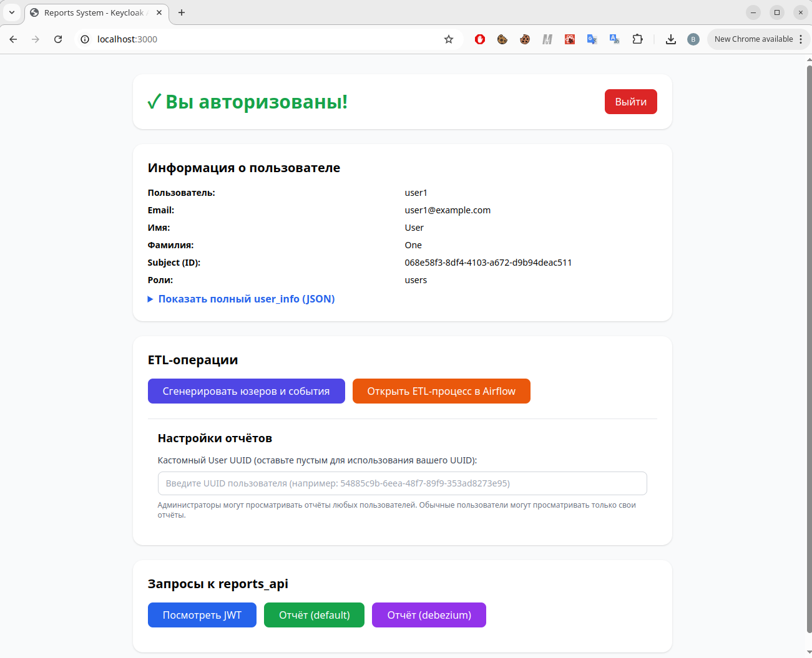
_Отладочный фронтэнд_

Открываем "Инструменты разработчика" Chrome, заходим в `Application --> Cookies --> session_id`. Пощёлкаем на кнопку "Посмотреть JWT" на нашем фронтэнде, убеждаемся, что `session_id` меняется при каждом вызове (это мы проксируем отладочный метод `reports_api` для просмотра JWT, так что session_id будет меняться).
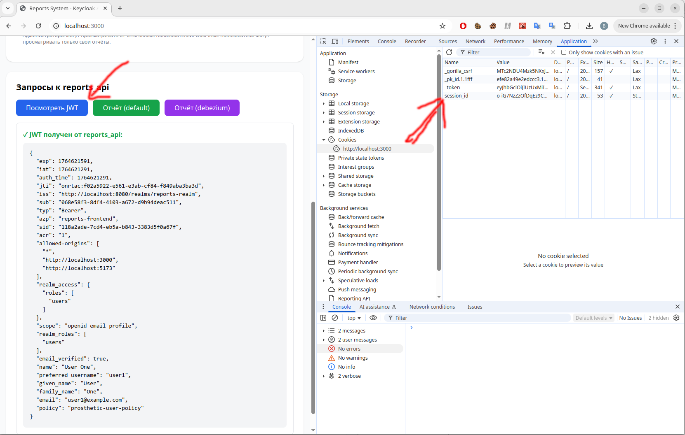
_session_id должно меняться при каждом обращении к reports_api_

Потом удалим это cookie -- перезагрузим страницу. Нас должны моментально перенаправить на страницу входа keycloak:
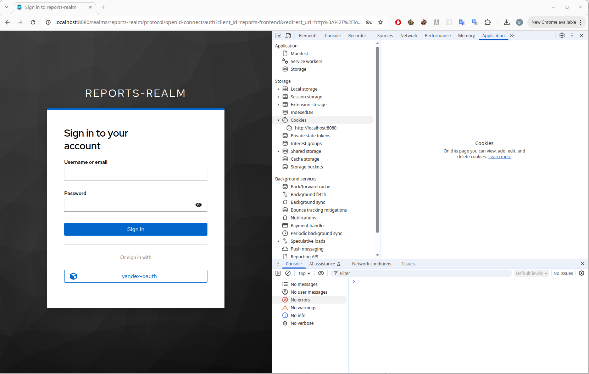
_После удаления session_id нас должны перенаправить перелогиниваться_

## Задача 4\. Добавьте LDAP для возможности получения данных о пользователях представительства BionicPRO в другой стране

1) В [`docker-compose.yaml`](../docker-compose.yaml) была добавлена секция `openldap-zambia`, она символизирует LDAP-сервер в другой стране.

2) Конкретные настройки пользователей LDAP, включая их пароли, живут в [`ldap/01-init-roles.ldif`](../ldap/01-init-roles.ldif), там мы задаём нескольких пользователей:

* `customer1` (пароль `customer1_password`)  
* `customer2` (пароль `customer2_password`)  
* `customer3` (пароль `customer3_password`)

3) В [`keycloak/realm-export.json`](../keycloak/realm-export.json) добавлена секция   
```json
"components": {  
 "org.keycloak.storage.UserStorageProvider"  
...
```

В этой секции были указаны настройки LDAP и добавлены Role Mapping: в частности, LDAP-роль `customers` конвертируется в `keycloak`-роль `prosthetic_users`.

Чтобы протестировать – зайдём под юзером `customer1` и паролем `customer1_password`:

_Заходим под customer1_


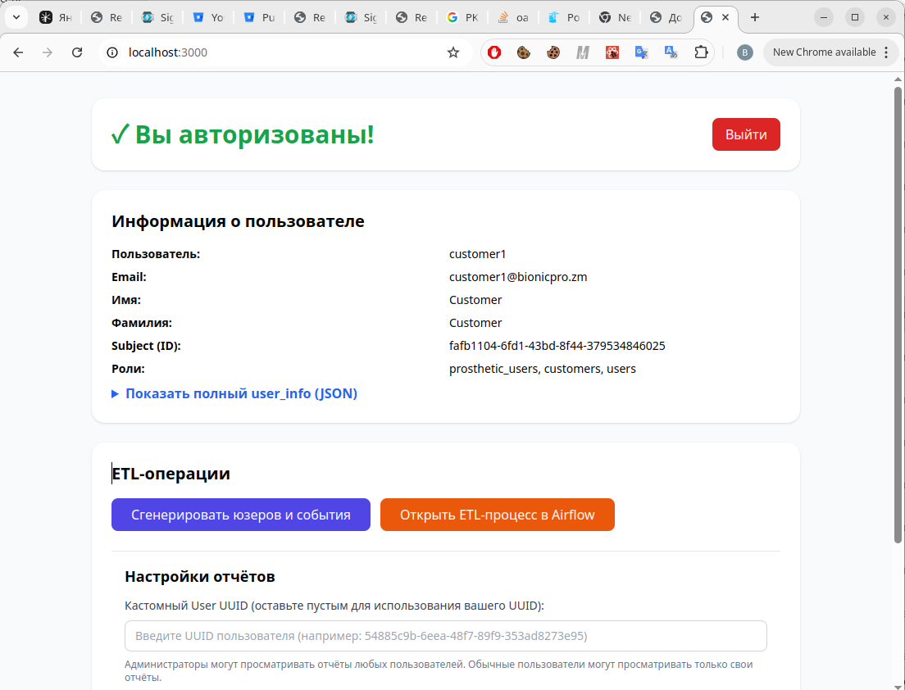
_Зашли!_

## Задача 5\. Настройте MFA

Настройки `keycloak` со включенным MFA для всех существующих и новых пользователей я положил в [`keycloak/realm-export-mfa.json`](../keycloak/realm-export-mfa.json) и [`keycloak/realm-export.json`](../keycloak/realm-export.json).

Настройки `keycloak` с отключенным MFA живёт в [`keycloak/realm-export-no-mfa.json`](../keycloak/realm-export-no-mfa.json)

Тестировал с Google Authenticator – вроде работало \= )

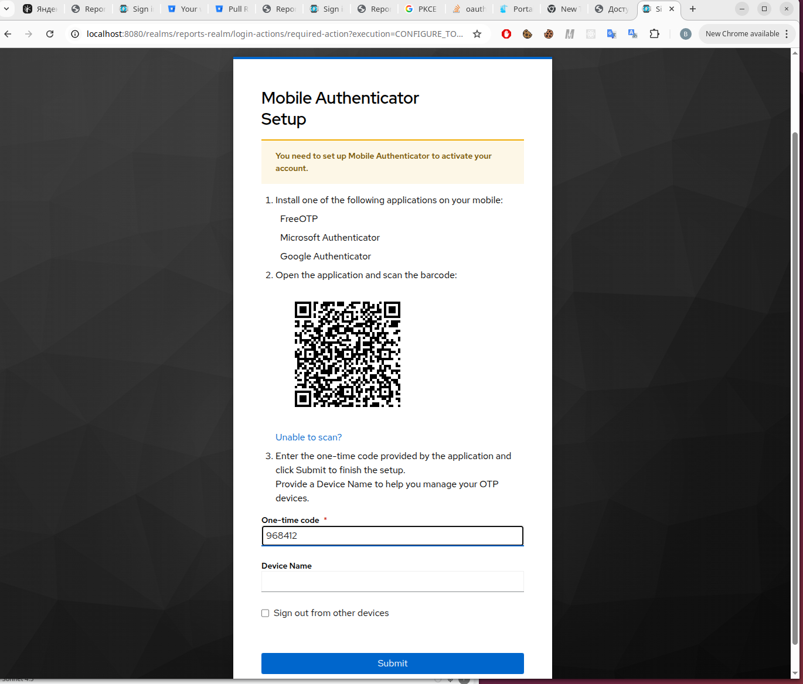
_При первом входе пользователя (пользователь `prosthetic1`, пароль `prosthetic123`)_ 

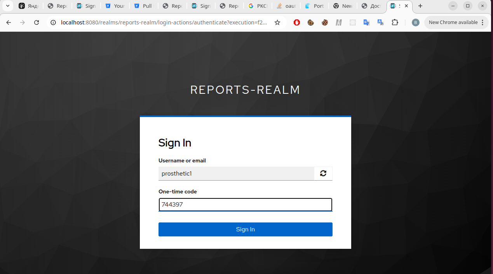
_При повторном входе пользователя (тот же пользователь)_  

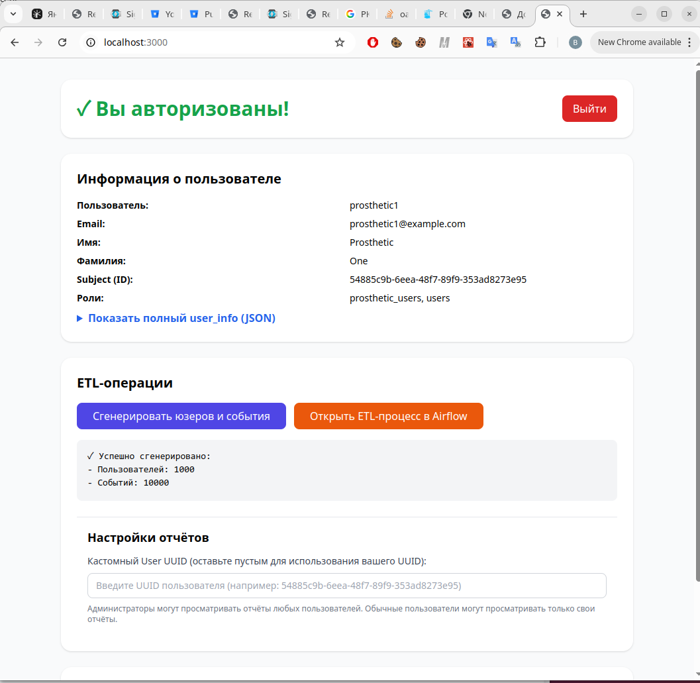
_Отладочный фронтэнд открывается, показывает, что нас пустили_

## Задача 6\. Добавьте OAuth 2.0 от Яндекс ID.

Здесь я сходил в [https://oauth.yandex.ru/](https://oauth.yandex.ru/) и создал там приложение: `bionicpro-app`
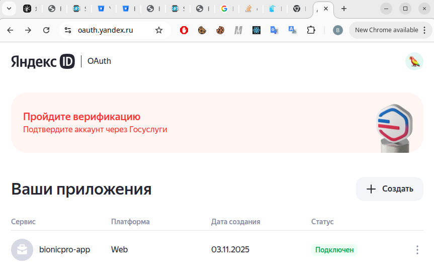
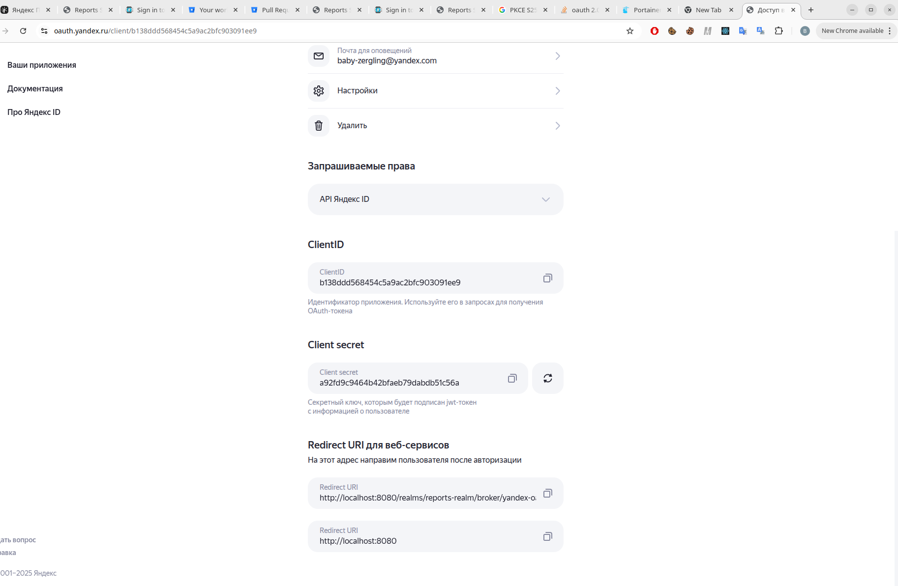

Далее – добавил Identity Provider Oauth 2.0 в `keycloak` (`keycloak` пришлось обновить до 26.4):  
```  
"identityProviders":
 {  
   "alias": "yandex-oauth",  
   "providerId": "oauth2",  
...  
```

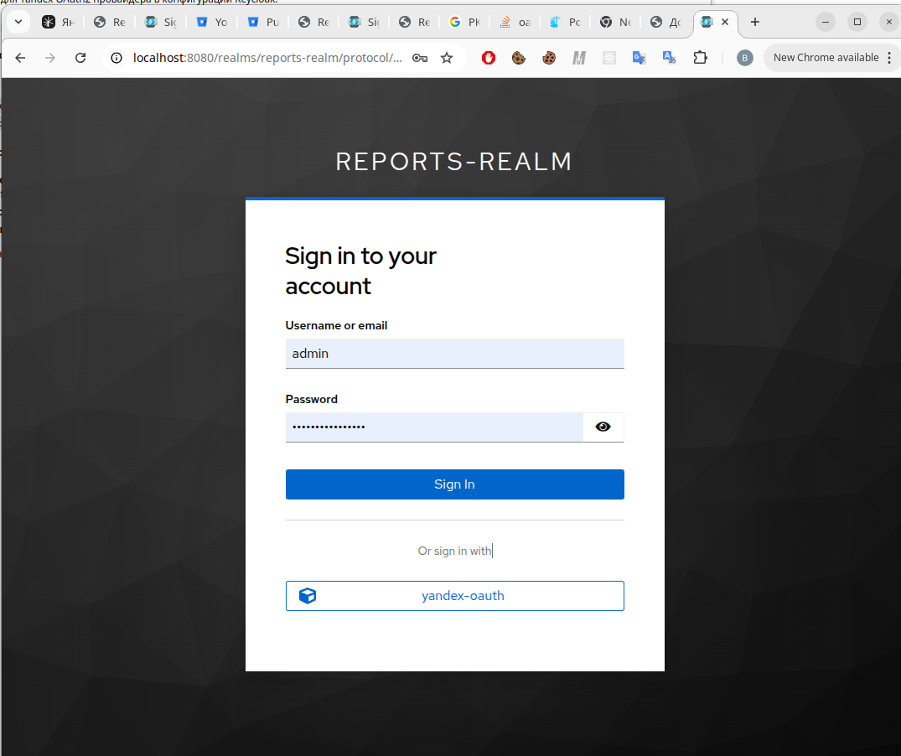
_Кнопка yandex-oauth появилась_

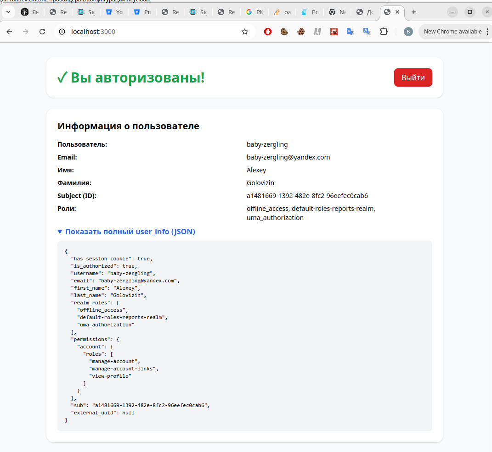

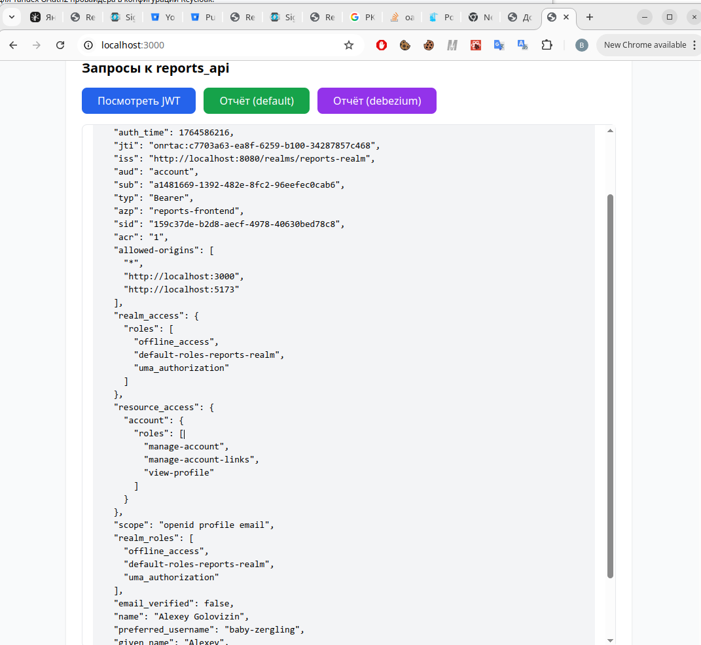
_Вроде работает..._

Предупреждение, что приложение получит доступ к таким-то данным аккаунта, мне показали, но это показывается только в первый раз, а яндекс-аккаунтов у меня всего два. Если критично, чтобы были скрины предупреждения – то дайте знать, пересоздам приложение в [oauth.yandex.ru](http://oauth.yandex.ru) и пересниму скрины ))