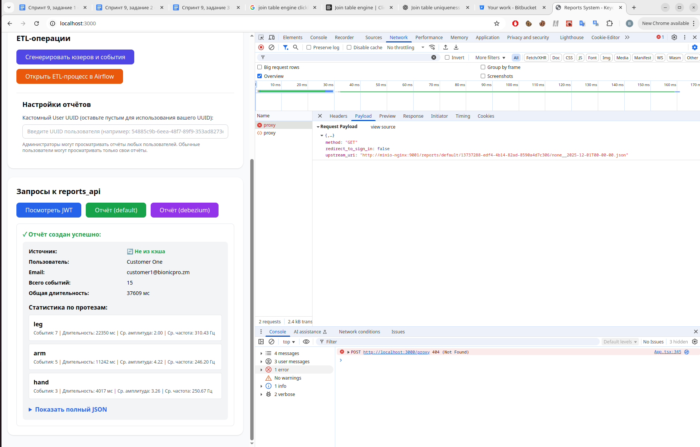
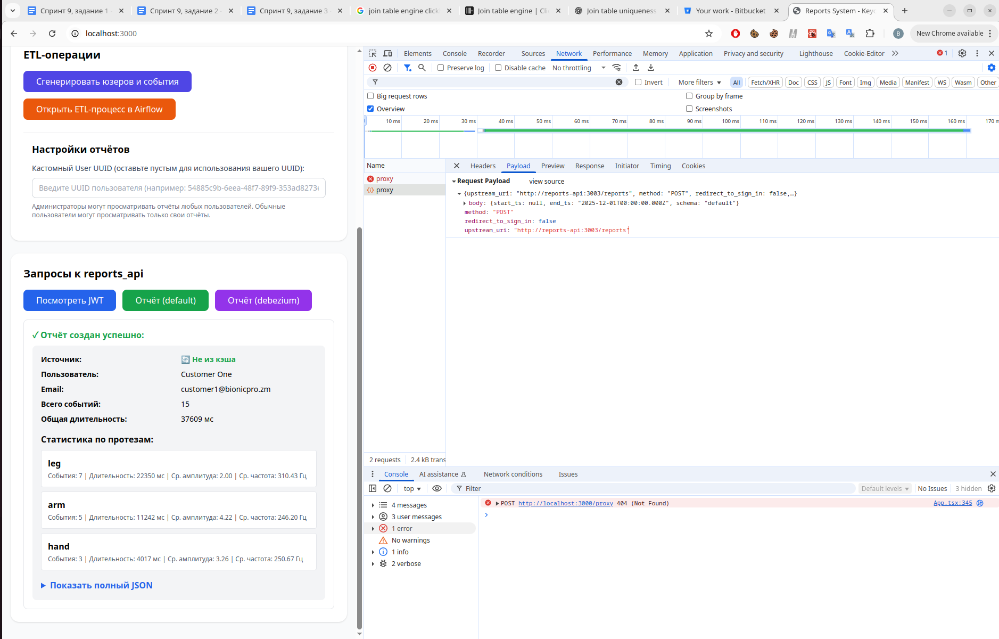
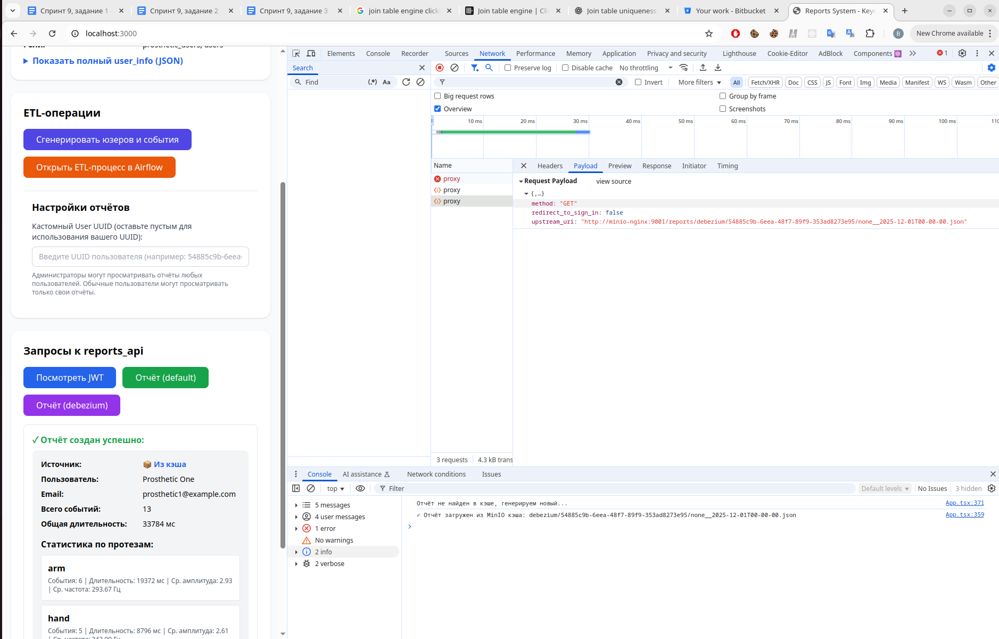

# Задание 3\. Снижение нагрузки на базу данных

Здесь мы добавили в нашу систему два новых микросервиса: `minio` и `minio-nginx` . А также немного доработали наш фронтэнд и reports+api.

## Структура хранения отчётов

* Мы создаём публичный бакет `reports` с 2 директориями для отчётов из разных схем: `debezium` и `default`.  
* Внутри каждой директории будут поддиректории по `user_uuid` или `external_uuid`, внутрь которых и будем класть отчёты (имя файла – по началу и концу отчётного периода).  
* Время начала отчётного периода сейчас всегда выбирается "от начала времён", время конца – до 00:00 первого числа текущего месяца. Потом можно изменить эту дискретность на меньшую (например, по неделям).

### Пример структуры бакета reports:
```
reports/
├── default/
│   ├── 54885c9b-6eea-48f7-89f9-353ad8273e95/
│   │   ├── none__2025-12-01T00-00-00.json
│   │   └── none__2025-11-01T00-00-00.json
│   ├── 7f7861be-8810-4c0c-bdd0-893b6a91aec5/
│   │   └── none__2025-12-01T00-00-00.json
│   └── customer1-ldap-uuid/
│       └── none__2025-12-01T00-00-00.json
└── debezium/
    ├── 54885c9b-6eea-48f7-89f9-353ad8273e95/
    │   ├── none__2025-12-01T00-00-00.json
    │   └── none__2025-11-01T00-00-00.json
    ├── 7f7861be-8810-4c0c-bdd0-893b6a91aec5/
    │   └── none__2025-12-01T00-00-00.json
    └── customer1-ldap-uuid/
        └── none__2025-12-01T00-00-00.json
```

- `default/` и `debezium/` — схемы ClickHouse, из которых генерируются отчёты
- `{user_uuid}/` — поддиректория для каждого пользователя
- `none__2025-12-01T00-00-00.json` — файл отчёта за период от начала времён до 2025-12-01 00:00:00
- Формат имени файла: `{start_ts}__{end_ts}.json` (если start_ts не указан, используется `none`)

## minio

* minio сделаем публичным, чтобы он раздавал публичные ссылки вида  [http://minio:9000/reports/default/path+to+my+reports.json](http://minio:9000/reports/default/path_to_my_reports.json), ограничивать доступ будем через nginx-прокси  
* Веб-интерфейс для отладки будет по [http://localhost:9001](http://localhost:9001), юзер `minio_user`, пароль `minio_password`  
* подробные настройки `minio` – см. секцию `minio` в `docker-compose.yaml` и папку [`minio`](../minio)
* на боевой системе `minio` будет доступно только изнутри кластера и через `minio-nginx`, и в `auth_proxy` будет дополнительное правило, что в его методе `/proxy` нельзя проксировать обращения к minio напрямую (сейчас этого не реализовывалось).

## nginx-прокси minio-nginx

Здесь мы с Claude Sonnet создали специфическое reverse proxy с помощью OpenResty Nginx (т.е. nginx с поддержкой Lua).

Здесь minio-nginx делает следующее (с помощью Lua-скрипта):
- разбирает JWT, которое выставил `auth_proxy`,  
- проверяет роли пользователя, его `user_uuid` или `external_uuid`, сличает их с тем путём в minio, куда юзер хотел обратиться;  
- если UUID юзера и его права соответствуют тому пути, куда надо обратиться – проксирует запрос на minio (делает запрос на `http://minio/reports/{schema}/{user+uuid}/{report+name}.json`

Если нет прав – возвращаем 403 Error  
Если файл не найден – 404 Error.

## Доработки в Reports API

В эндпоинте `/reports` мы теперь подключаемся к minio через python-клиент minio – и кладём JSONку с отчётом в соответствующую директорию minio.

## Доработки на фронтэнде

Теперь фронтэнд, сначала обращается в метод /proxy сервиса auth+proxy с другим путём проксирования (т.е. с обращением к minio-nginx):  
```

* method: "GET"  
* redirect+to+sign+in: false  
* upstream+uri: "http://minio-nginx:9001/reports/debezium/54885c9b-6eea-48f7-89f9-353ad8273e95/none++2025-12-01T00-00-00.json"
```

Если это вернуло 404 Error, то потом будет обычное обращение к auth+proxy с путём проксирования в /reports:  
```
* {upstream+uri: "http://reports-api:3003/reports", method: "POST", redirect+to+sign+in: false,…}  
  * body: {start+ts: null, end+ts: "2025-12-01T00:00:00.000Z", schema: "debezium"}  
  * method: "POST"  
  * redirect+to+sign+in: false  
  * upstream+uri: "http://reports-api:3003/reports"
```

## Как проверить

Заходим в [http://localhost:3000](http://localhost:3000) под каким-нибудь пользователем, под которым ещё не смотрели отчёты (например, юзер customer1 с паролем customer1+password)

Открываем Chrome → Инструменты разработчика → Network

Жмём кнопку: “Отчёт (default)”.

На первый раз отчёт выведется с признаком “Не из кэша” и будут 2 запроса к auth+proxy: неуспешный (проксирование запроса к minio-proxy) и успешный (проксирование запроса к reports-api \-\> /reports)

_Неуспешный запрос к кэшу_


_И запрос в Reports API, отсюда получаются 2 обращения к `/proxy`_

Жмём кнопку “Отчёт (default)” ещё раз.  
На этот раз отчёт выведется с признаком “Из кэша” и будет +1 запрос к auth+proxy (успешный, проксирование запроса к minio-proxy)


_Теперь запрос из кэша будет успешным, и отсюда только +1 обращение к `/proxy`_

## Обновление кэша

### TTL для файлов отчётов

Реализовано два уровня TTL:

1. **Reports API**: При сохранении отчёта в MinIO выставляет метаданные с TTL **7 дней** (1 неделя)
   - Добавляются метаданные: `X-Amz-Meta-Ttl-Days`, `X-Amz-Meta-Created-At`, `X-Amz-Meta-Expires-At`
   - Логируется дата истечения отчёта

2. **MinIO**: Настроен lifecycle policy для бакета `reports` с TTL **40 дней**
   - Файлы старше 40 дней автоматически удаляются MinIO
   - Правило `ExpireOldReports` применяется ко всем файлам в бакете

Таким образом:
- Отчёты считаются актуальными **7 дней** (метаданные от reports_api)
- Физически удаляются через **40 дней** (lifecycle policy MinIO)
- Это позволяет иметь "устаревшие, но доступные" отчёты в течение 33 дней после истечения их актуальности