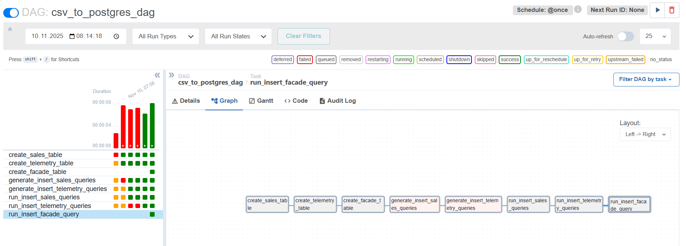
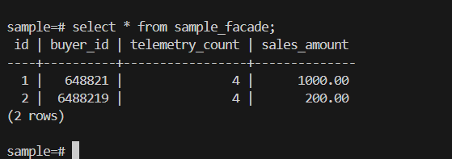

# Разработка сервиса отчётов

## Создать архитектуру решения для подготовки и получения отчётов

Архитектура решения:

## Разработать Airflow DAG и настроить его на запуск по расписанию

Добавлен DAG, извлекающий заказы из CRM, телеметрии, сохраняющий их в OLAP и генерирующий результаты витрины:

DAG отработал, таблица витрины заполнена в OLAP БД:

