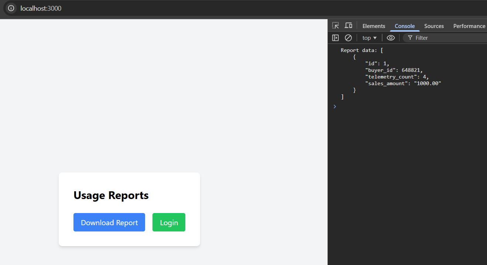

# Разработка сервиса отчётов

## Создать архитектуру решения для подготовки и получения отчётов

Архитектура решения:

## Разработать Airflow DAG и настроить его на запуск по расписанию

Добавлен DAG, извлекающий заказы из CRM, телеметрии, сохраняющий их в OLAP и генерирующий результаты витрины:

DAG отработал, таблица витрины заполнена в OLAP БД:

# Создайте бэкенд-часть приложения для API + Реализуйте ограничение доступа к эндпоинту отчётности + Добавьте в UI кнопку получения отчёта и вызова эндпоинта его генерации

- Добавлен API получения отчета в bionicpro-auth.

